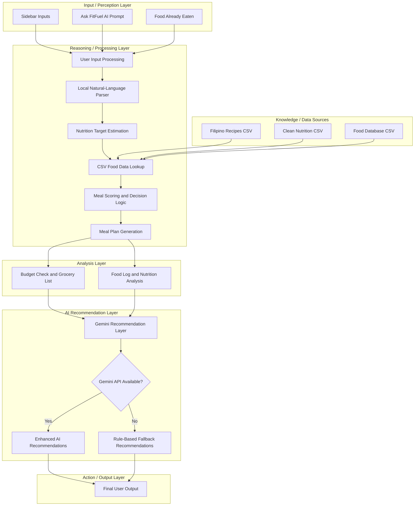

# FitFuel AI: A Budget-Friendly Filipino Meal Planning and Nutrition Tracking Agent for Busy Beginners

FitFuel AI helps users plan affordable Filipino meals based on their budget, available ingredients, schedule, and basic fitness goals. It supports users who are trying to bulk, cut, maintain, or improve beginner recomposition, but all nutrition values are estimates and not medical advice.

## Target Users

**Primary users:**
- busy beginners
- students
- budget-conscious individuals
- casual fitness users
- users who want simple Filipino meal planning and nutrition tracking

**Secondary users:**
- gym beginners
- casual gym goers
- users with basic fitness goals like bulk, cut, maintain, or beginner recomposition

The app demonstrates agentic behavior: planning, tool and data usage (CSV datasets), decision rules, session memory, automated recommendations, and robust fallback behavior when the external API is unavailable.

## Problem Statement

Gym beginners, students, and casual fitness-focused individuals often struggle to maintain a consistent diet because meal planning requires time, preparation, discipline, and continuous tracking. For busy individuals, deciding what to eat, preparing meals ahead of time, monitoring estimated nutrition intake, and staying within a daily food budget can become overwhelming.

Many Filipino users prefer meals that are affordable and familiar (rice meals, eggs, adobo, tinola, monggo, pork dishes), but generic meal planners often suggest Western-style meals that do not match local budgets or ingredients.

FitFuel AI addresses this by generating affordable Filipino-context meal plans, estimating nutrition targets, suggesting Filipino recipes, tracking food logs in-session, and recommending adjustments when the plan does not meet nutrition or budget goals.

## Key Features

- Modern Streamlit dashboard UI (dark navy theme, orange accent, custom CSS)
- Sidebar profile and constraints form (goal, budget, meals per day, schedule, restrictions)
- **Ask FitFuel AI** on Overview (chat-style input; parsed locally with Python, not Gemini per message)
- **Generate Recommendations** on Overview (external API on button click; **Enhanced** or **Standard** label)
- Nutrition target estimator (safe formulas; not medical advice)
- Filipino meal plan generation using `data/filipino_recipes_100_dataset.csv`
- Filipino recipe suggestions based on available ingredients and budget
- Food logging (session-only) using `data/fitfuel_clean_daily_food_nutrition_dataset.csv` (with recipe logging option)
- Budget check that treats available ingredients as already owned
- Nutrition gap analysis for calories, protein, carbs, fats, fiber, and budget
- Grocery list (missing ingredients plus optional market item)
- Natural-language request parsing (budget, meal types, available ingredients, market price)
- Google Gemini API for natural-language recommendations (with model fallback chain and rule-based fallback)
- Five user-facing tabs: Overview, Meal Plan, Filipino Meal Suggestions, Food Log, Nutrition Analysis

## Datasets Used (Source of Truth)

Default project-relative paths (loaded automatically; path overrides only when `DEBUG_MODE = True` in `app.py`):

| File | Purpose |
|------|---------|
| `data/filipino_recipes_100_dataset.csv` | Filipino dish recommendations and meal plan generation |
| `data/fitfuel_clean_daily_food_nutrition_dataset.csv` | Food lookup, snacks, and food logging |
| `food_database.csv` | Optional curated fallback for logged-food cost estimates |

CSV files and Python calculations are the **source of truth** for calories, macros, fiber, costs, budget checks, and food log totals. Gemini is not used to invent nutrition values.

If a dataset is missing, the app returns an empty DataFrame with expected columns and shows: *Some food data is currently unavailable. The app will continue using available sources.*

## Gemini API (Required External Integration)

- Uses `google-generativeai` and `GEMINI_API_KEY` from `.env` (see `.env.example`)
- Called **only** when the user clicks **Generate Recommendations** on the **Overview** tab
- User-facing label: **Recommendation type: Enhanced** (not “Gemini-enhanced” in the UI)
- Output appears under **Personalized Recommendations** on Overview
- Model fallback chain (tries in order): `gemini-2.5-flash`, `gemini-2.5-flash-lite`, `gemini-2.0-flash`, `gemini-1.5-flash`
- Generation config: `temperature=0.3`, `max_output_tokens=300`
- Prompt requires: *Use only the calculated data provided. Do not invent calories, macros, fiber, cost, or medical advice.*
- Full CSV files are **not** sent to Gemini; only a compact JSON summary of calculated results
- On failure or invalid output: rule-based recommendations with message *Enhanced recommendations are currently unavailable. Standard recommendations are shown instead.*

### Security

- `.env` contains your real API key and must **not** be committed to GitHub (listed in `.gitignore`)
- `.env.example` is a template only
- Never expose API keys in screenshots, demos, or public repositories
- Developer Debug shows key loaded (Yes/No) and key length only, never the key itself

## Technology Stack

- Python
- Streamlit
- Pandas
- NumPy
- Google Gemini API
- google-genai
- python-dotenv
- CSV datasets
- Git
- GitHub

## Setup Instructions

### Prerequisites

- Python 3.10+
- pip

### Install

```bash
cd "ANALYTICS FINALS AI AGENT"
python -m venv venv
venv\Scripts\activate
pip install -r requirements.txt
```

### Add API Key (recommended for final demo)

1. Copy `.env.example` to `.env`
2. Add your key:

```env
GEMINI_API_KEY=your_gemini_api_key_here
```

### Run

```bash
streamlit run app.py
```

Or:

```bash
python -m streamlit run app.py
```

## System Architecture

FitFuel AI follows a perception → reasoning → action agent architecture. The system collects user inputs, parses natural-language requests, estimates nutrition targets, retrieves food data from CSV datasets, applies meal scoring logic, and generates meal planning outputs. Gemini is used only as an AI recommendation layer, while CSV datasets and Python calculations remain the source of truth.

Architecture flow:

User Input → Local Parser → Nutrition Target Estimation → CSV Data Lookup → Meal Scoring Logic → Meal Plan Generation → Food Log & Budget Analysis → AI Recommendation Layer → Final Output



## Agent Design and Decision Logic

### User input processing

- Sidebar captures profile (weight, goal, budget, meals per day, cooking time, workout time), preferences, restrictions, available ingredients, optional market item, and optional natural-language request.
- On **Create My Plan**, natural-language text is parsed once for budget, meal count, ingredients, and market purchases.
- **Food already eaten today** is parsed into the food log only on the **first** plan creation of the session so manual log entries are not overwritten on regenerate.

### Nutrition target estimation

- Calories, protein, carbs, fats, fiber, and hydration are estimated from weight and goal using safe general formulas.
- These targets are displayed as estimates only and are not medical advice.

### Filipino recipe dataset lookup

- `data/filipino_recipes_100_dataset.csv` is filtered by goal, cooking time, meal type, allergies, and dislikes.
- Recipes are scored by ingredient match, protein per cost, and budget for missing ingredients only (available ingredients are treated as owned).

### Cleaned daily food dataset lookup

- `data/fitfuel_clean_daily_food_nutrition_dataset.csv` supports food logging and keyword matching for items already eaten.
- `food_database.csv` optionally supplies cost estimates when the clean dataset has no price.

### Python calculations as source of truth

- Meal plan totals, gap analysis, remaining targets after logging, grocery lists, and budget checks are computed in Python from CSV rows.
- PyArrow display issues are avoided via `prepare_display_df()` for any processed tables shown in the UI.

### Gemini API role

- Gemini turns **already-calculated** summaries into short personalized advice (timing, gaps, budget-friendly adjustments).
- It is not called on every rerun; results are cached by a stable payload hash (excluding live food log totals from the cache key).

### Fallback behavior

- If the API key is missing, models return 404, validation fails, or all models fail, the app uses `generate_rule_based_recommendations()` and sets source to **Standard fallback**.
- The meal plan, grocery list, and nutrition analysis still work without Gemini.

### Hallucination handling

- Output must be 80–220 words, must not include invented kcal or gram values, and must not mention blocked allergy or dislike terms.
- Invalid Gemini output is discarded and replaced with rule-based text.

### Session-only food logging

- Food log entries live in `st.session_state.food_log` for the active session only.
- Clearing the log or starting a new session resets logged items.
- Food Log uses Streamlit session state to remember foods eaten during the active session and update consumed nutrition totals and remaining targets. Food log data is temporary and is not permanently stored.

## Prompting Strategy

FitFuel AI uses structured instruction prompting with grounded context. The Gemini prompt provides:

- role definition
- user goal and constraints
- calculated meal plan summary
- nutrition totals
- budget status
- food log totals
- gap analysis
- explicit safety rules
- output constraints

The model is instructed to:

- use only calculated data provided by the app
- avoid inventing calories, macros, fiber, cost, or medical advice
- avoid restricted or disliked foods
- keep the response short and practical
- produce recommendations based on CSV/Python-generated results

This is not pure chain-of-thought prompting shown to the user. Instead, it is a grounded instruction prompt that supplies structured context and constraints to reduce hallucination risk. 

Gemini is used only for natural-language recommendation generation, while CSV datasets and Python calculations remain the source of truth.

## Testing

The project includes a comprehensive test suite to ensure robustness and correctness:

- **Meal Plan Quality (`smoke_test.py` TC1)**: Verifies that generated meal plans include diverse Filipino dishes and restrict overly generic fallback meals.
- **Natural Language Parsing (`smoke_test.py` TC4/TC5)**: Verifies extraction of budget, available ingredients, desired items, and limits parser overlap.
- **Food Log Parsing**: Verifies that `parse_quantity_food()` correctly strips common serving/unit words and supports fractional values to match food data accurately.
- **Execution**: Run `python smoke_test.py` to run the test suite and evaluate the agent's output.

## Responsible AI Reflection and Limitations

- Nutrition values and food prices in CSV files are **estimates**. Real values vary by brand, portion, cooking method, store, market, location, and time.
- Gemini is used only for natural-language recommendations, not as the source of exact nutrition numbers.
- If Gemini fails or produces unreliable output, the app uses rule-based recommendations from calculated gaps and profile.
- FitFuel AI does **not** replace doctors, registered dietitians, or certified fitness professionals.
- The app avoids extreme dieting advice and does not guarantee body transformation outcomes.
- Food logs are stored only during the active browser session.
- Allergies and disliked foods are filtered from recipe suggestions where possible.
- A short footer disclaimer in the app reminds users that output is estimated support only, not medical advice.

## UI Notes (Demo-Ready)

- Modern dashboard layout using native Streamlit with custom CSS. Includes a **Hero** section, and clean **Navigation Tabs** (Overview, How It Works, Meal Plan, Suggestions, Food Log, Analysis).
- **Ask FitFuel AI** enables natural-language goal-setting, processed locally.
- **Generate Recommendations** accesses the AI layer for on-demand advice.
- Datasets are processed and presented via clean summary cards instead of raw tables.
- **Developer Options** are hidden by default (`DEBUG_MODE=False`).

### Meal plan scoring (CSV + Python)

Meal and suggestion ranking uses a point-based score: preferred foods (+5), available ingredients (+5), meal type fit (+3), budget fit (+3), protein for goal (+2–3), very-busy simplicity (+1–2), disliked/allergy exclusion (-100), vague ingredients penalized, low-confidence nutrition rows deprioritized, and seafood/spam penalized when not in the user's preferences.


## Limitations

- Dataset values and costs are approximate and may not match local prices.
- Recipe complexity is estimated using ingredient count (not real cook time).
- Some free-text inputs may not be fully extracted by heuristic parsing.
- No persistent user accounts or long-term storage in this prototype.

## Future Improvements

- Serving and portion scaling per target calories
- Multi-day meal prep planning
- Improved cost estimation for the clean food dataset
- Expanded recipe dataset and regional variants
- Export plan and grocery list as PDF
